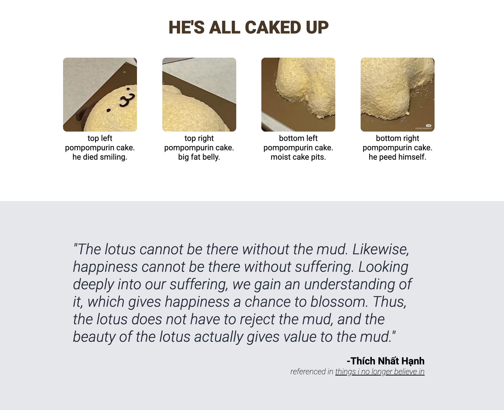

# css-landing-page

me when i touch css for the first time. deployed [here](https://raffycastlee.github.io/.css-landing-page/). template/prompt from [the odin project's fullstack-js](https://www.theodinproject.com/paths/full-stack-javascript).

## todo
- [x] finish header
- [x] finish block-1
- [x] finish block-2
- [x] finish block-3
- [x] finish block-4
- [x] finish footer
- [x] swaggify
- [ ] clean up css

## _screens_

_Header and Block-1_

_Block-2 and Block-3_

_Block-4 and Footer_
